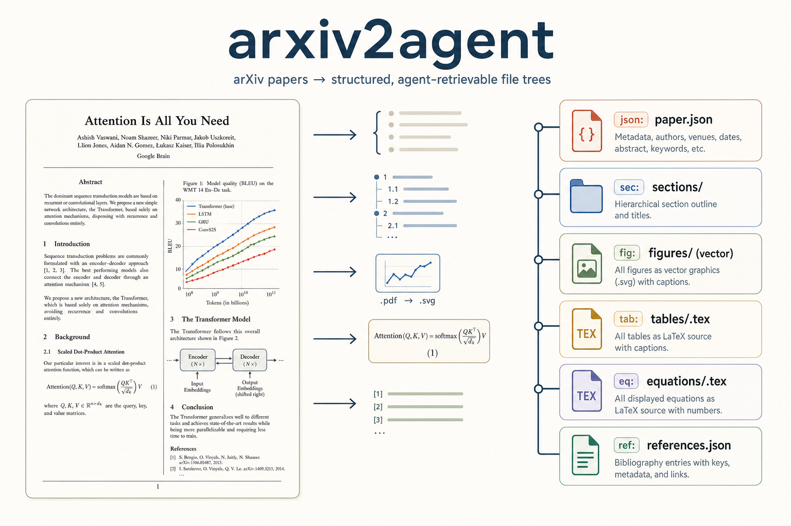

# arxiv2agent

**English** | [简体中文](README.zh-CN.md)



Turn arXiv papers into **structured, multimodal, agent-retrievable file trees**.

No LLM anywhere in the loop — pure rule-based parsing of the paper's LaTeX source: deterministic, free, and fast (measured: 0.1–0.3 s to parse a paper; 10 new papers end-to-end incl. download in 42 s; 10 cached papers rebuilt in 0.9 s). Give an agent a paper title or an arXiv ID; seconds later the whole paper is local, structured, and queryable.

```
arxiv2agent 2305.13860 -o corpus/                         # one paper
arxiv2agent 2305.13860 1706.03762 2005.14165 -o corpus/   # batch: pass a list of IDs
```

```
corpus/2305.13860/
├── paper.json                ← complete record, one fixed schema for EVERY paper
├── README.md                 ← navigation entry point
├── sections/01-introduction.md, 02-background.md, …
├── figures/fig-overview.pdf  ← original vector graphics (all subfigures kept)
│   figures/fig-prompt.txt    ← text-body figures (prompt boxes, examples)
├── tables/tab-results.tex    ← raw LaTeX tabular
├── equations/eq-loss.tex     ← raw LaTeX, typeset-identical
├── listings/lst-1.py         ← runnable code
├── references.json           ← citations resolved to BibTeX
└── footnotes.json
```

<!-- TODO: replace with docs/digest-structure.png (annotated screenshot) -->

## Idea

I treat agent paper-reading as a **retrieval problem**: every section, figure, table, equation, algorithm, listing, and citation becomes an addressable entity with a stable typed ID (`sec:3.2`, `fig:overview`, `eq:loss`, `[@xu2021]`), its content kept in the native modality (vector PDF, raw LaTeX, runnable code, markdown prose), plus one `paper.json` whose schema is identical across the whole corpus. Reading papers at scale stops being search-download-parse per paper — one list comprehension fetches a given section from many papers at once.

## Scenarios

**1. "Compare the Introductions of these ten papers."** — ten papers, one loop, seconds:

```python
import json
intros = {
    pid: [s["text"] for s in json.load(open(f"corpus/{pid}/paper.json"))["sections"]
          if "introduction" in s["title"].lower()]
    for pid in ids   # ten arXiv IDs
}
```

**2. "Take Fig. 2 of this paper as a reference and generate one in a similar style."** — `figures/fig-*.pdf` are the *original vector graphics* copied from the source (all panels of multi-subfigure blocks), real reference assets rather than screenshots. Pair it with my [GPT-Image2-Skill](https://github.com/wuyoscar/GPT-Image2-Skill) for the generation half: this tool retrieves the reference, that one generates.

**3. "Which papers does the Related Work cite? Give me the BibTeX."** — `references.json` has every cite key resolved to title/authors/year plus the verbatim `bib_raw` entry, with `cited_in` marking which sections use it.

**4. "Give me Equation 1 exactly as typeset."** — `equations/eq-*.tex` is the untouched original LaTeX; paste it anywhere and it renders identically. Same for tables and algorithms.

The same structure supports claim verification (follow `[@key]` / `[#fig:x]` markers from prose to evidence, with `is_appendix` separating main-text from appendix support) and corpus building (fixed schema + per-field provenance).

## Install

```bash
git clone https://github.com/wuyoscar/arxiv2agent && cd arxiv2agent
uv tool install .
```

### As an agent skill (recommended)

This tool is built to be *operated by* a coding agent (Claude Code, Codex, …). Paste this to your agent:

> Clone https://github.com/wuyoscar/arxiv2agent, install it with `uv tool install .`, then read its `SKILL.md` and register it as a skill so you can digest and query arXiv papers for me.

[`SKILL.md`](SKILL.md) teaches the agent the CLI, the digest layout, and the batch program-calling patterns.

## CLI

```
arxiv2agent ARXIV_ID [ARXIV_ID …] [-o OUT_DIR] [--local-folder PATH] [--include-source]
```

| flag                 | meaning                                                                       |
|----------------------|-------------------------------------------------------------------------------|
| `ARXIV_ID …`         | one or more IDs, e.g. `2305.13860 1706.03762`. Omit with `--local-folder`.    |
| `-o, --output`       | parent directory; each digest lands at `<output>/<arxiv_id>/`. Default `.`    |
| `--local-folder`     | use a local LaTeX folder instead of downloading.                              |
| `--include-source`   | also mirror the raw LaTeX tree to `<digest>/source/`. Off by default.         |

In batch mode a failing paper doesn't abort the run; failures are summarized at the end.

## Speed

Measured (M-series MacBook, real arXiv papers):

| scenario | time |
|---|---|
| parse one paper (cached) | 0.13 s (0.29 s for a GPT-3-length paper) |
| 10 new papers, incl. download, end to end | 42 s |
| rebuild 10 papers (all cached) | 0.9 s |

Each paper is downloaded once, ever; everything after is fully offline. Downloads have built-in politeness spacing and backoff.

## Entity IDs & inline markers

Every entity gets a stable type-prefixed ID; the original `\label{}` survives as `latex_label`. Unlabeled entities are auto-numbered (`eq:1`, `eq:2`), never null.

| entity    | prefix    | example        |
|-----------|-----------|----------------|
| section   | `sec:`    | `sec:3.2.1`    |
| figure    | `fig:`    | `fig:overview` |
| table     | `tab:`    | `tab:results`  |
| equation  | `eq:`     | `eq:loss`      |
| algorithm | `alg:`    | `alg:tool`     |
| listing   | `lst:`    | `lst:1`        |
| footnote  | `fn:`     | `fn:1`         |
| citation  | (bib key) | `xu2021`       |

Cross-references in section markdown stay readable: `[@key]` (citation → `references.json`), `[#fig:x]` / `[#tab:x]` / `[#eq:x]` (entity → its file), `[^fn:N]` (footnote), `**bold**` / `*italic*` (author emphasis, preserved).

## Honesty & provenance

The rule-based principle: **what is extracted must be exact; what cannot be extracted must be visible — never guessed.**

- `metadata.*_source` records how each field was obtained (`title_cmd` / `abstract_env` / `arxiv_api` / `none`).
- Authors, submission dates, and `arxiv_version` come from the metadata arXiv publishes on each paper's abs page — every digest is pinned to a specific paper revision.
- Citations resolve against `.bib` when the source ships one; `.bbl`-only papers keep `title: null` rather than a fabricated reference.
- `paper.json.warnings` reports surviving LaTeX residue per paper, so corpus pipelines can filter on extraction quality.

## Library API

```python
from arxiv2agent import digest, write_digest

paper = digest(arxiv_id="2305.13860")          # → dict (full record)
write_digest(paper, output_dir="./corpus/")
```

## Acknowledgements

Inspired by several excellent projects rethinking how agents consume papers, including **arxiv-to-prompt** (whose LaTeX download/flatten pipeline this project vendors — see [NOTICE.md](NOTICE.md)) and **DeepXiv**.

## License

MIT.
