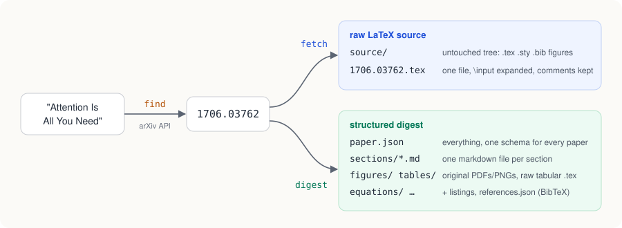

# arxiv2agent

**English** | [简体中文](README.zh-CN.md)

A few small download tools that let an agent pull any arXiv paper onto disk as **LaTeX source**, so it reads the real paper instead of search snippets or a lossy PDF.



```bash
arxiv2agent find "Attention Is All You Need"   # title → arXiv ID (arXiv API)
arxiv2agent fetch 1706.03762 -o papers/        # raw source tree + one flattened .tex
arxiv2agent digest 1706.03762 -o papers/       # structured: paper.json, sections/, tables/, …
```

`fetch` and `digest` take a list of IDs. No LLM inside, no API key; arXiv requests are rate-limited politely and cached.

## What it looks like

```console
$ arxiv2agent find "Attention Is All You Need" -n 3
1706.03762	2017	Attention Is All You Need	Ashish Vaswani et al.
2104.04692	2021	Not All Attention Is All You Need	Hongqiu Wu et al.
2501.06425	2025	Tensor Product Attention Is All You Need	Yifan Zhang et al.

$ arxiv2agent fetch 1706.03762 -o papers/
$ ls papers/1706.03762/source
Figures/  background.tex  introduction.tex  ms.tex  nips_2017.sty  results.tex  …
```

**"How did they typeset Table 1?"** The agent greps `papers/1706.03762/1706.03762.tex` and gets the real thing: `booktabs`, `\toprule`, a `\rule{0pt}{2.0ex}` strut, the commented-out `\scalebox` the authors tried:

```latex
\begin{tabular}{lccc}
\toprule
Layer Type & Complexity per Layer & Sequential & Maximum Path Length  \\
\hline
\rule{0pt}{2.0ex}Self-Attention & $O(n^2 \cdot d)$ & $O(1)$ & $O(1)$ \\
```

**"What does Section 3.2 of this paper actually claim?"** The agent runs `digest`, reads `sections/` or `paper.json`, and answers from the full text, with exact equations (`equations/*.tex`) and resolved BibTeX (`references.json`).

**"Compare the Introductions of these ten papers."** Run one `digest` with ten IDs, then loop over `paper.json` (the schema is the same for every paper).

## Install

```bash
uv tool install git+https://github.com/wuyoscar/arxiv2agent
```

For an agent (Claude Code, Codex, …), tell it:

> Install https://github.com/wuyoscar/arxiv2agent with `uv tool install`, then read its `SKILL.md` and register it as a skill.

[`SKILL.md`](SKILL.md) covers the commands, the digest layout, and when to use which.

## Acknowledgements

The LaTeX download/flatten pipeline is vendored from **arxiv-to-prompt** (see [NOTICE.md](NOTICE.md)). Also inspired by **DeepXiv**.

## License

MIT.
